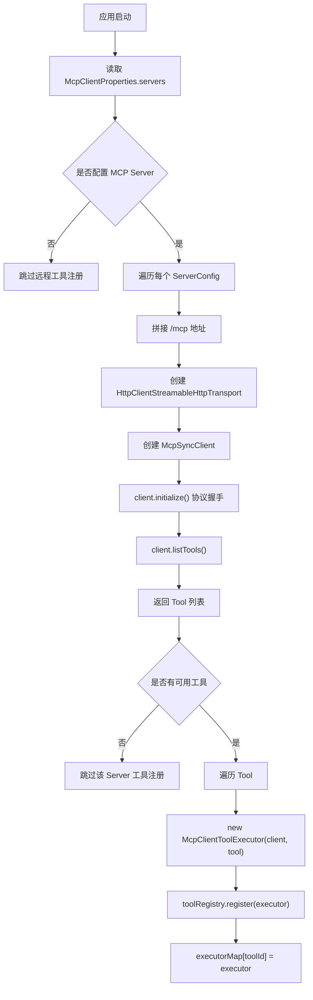
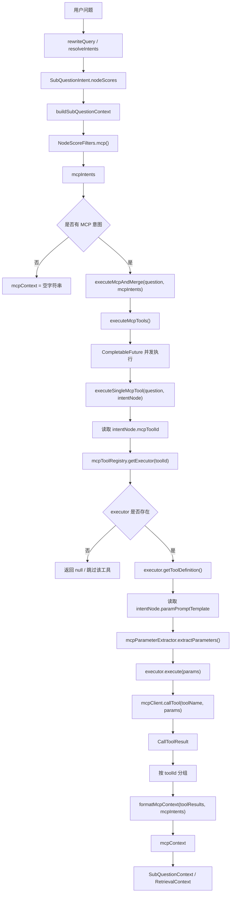
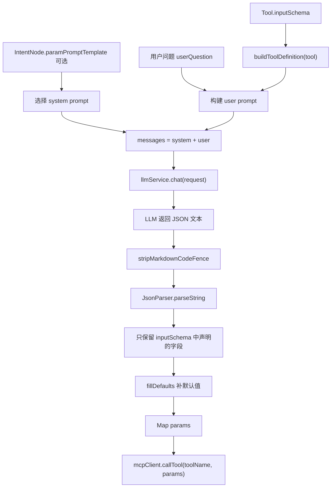

# KoawaAgent 学习笔记

## 目录

- [2026-07-08：RAG 主链路、Pipeline 与项目重构](#2026-07-08rag-主链路pipeline-与项目重构)
- [2026-07-09：多通道检索与并行检索模板](#2026-07-09多通道检索与并行检索模板)
- [2026-07-10：MCP 工具注册、调用与参数提取](#2026-07-10mcp-工具注册调用与参数提取)
- [RAG 主链路与检索链路总图](#rag-主链路与检索链路总图)
- [后续记录规则](#后续记录规则)

## 2026-07-08：RAG 主链路、Pipeline 与项目重构

### 今日概览

今天主要完成三件事：

1. 学习当前项目的流式 RAG 请求主链路。
2. 将项目重命名为 KoawaAgent，并推送到新仓库。
3. 尝试本地启动项目，确认当前启动阻塞点，并继续阅读检索 pipeline。

### 1. 流式 RAG 主链路

第一天梳理出的 RAG 对话入口链路：

```text
Client
  -> RAGChatController
  -> RAGChatServiceImpl
  -> StreamCallbackFactory
  -> ChatQueueLimiter
  -> StreamChatTraceRunner
  -> StreamChatPipeline
  -> LLMService.streamChat
  -> StreamChatEventHandler
  -> SSE 响应 + assistant 消息持久化
```

核心理解：

- `RAGChatController` 是 HTTP/SSE 入口，职责较薄。
- `RAGChatServiceImpl` 负责创建一次聊天任务，包括 `conversationId`、`taskId`、callback、限流队列、trace 包装和 pipeline 上下文。
- `StreamChatContext` 用来承载固定输入和 pipeline 执行过程中的中间状态。
- `StreamChatPipeline` 是固定 RAG 流水线，不是 agent loop。
- `StreamChatEventHandler` 负责把 LLM 流式输出推给前端，并在结束后持久化 assistant 回复。
- `StreamChatTraceRunner` 负责包装 callback，记录首包、完成、失败等 trace 生命周期。

阶段性判断：

```text
当前系统 = 静态 RAG pipeline。

未来如果做 agent 模式，应该在 RAGChatServiceImpl 附近分支，
复用现有 retrieval、MCP、memory、trace、SSE 能力。
```

### 2. StreamChatPipeline

阅读 `StreamChatPipeline.execute(ctx)` 后，主流程理解为：

```text
loadMemory
  -> rewriteQuery
  -> resolveIntents
  -> handleGuidance
  -> handleSystemOnly
  -> retrieve
  -> handleEmptyRetrieval
  -> streamRagResponse
```

核心理解：

- `loadMemory` 加载历史对话，并把当前用户问题加入历史消息。
- `rewriteQuery` 对当前问题做改写和子问题拆分。
- `resolveIntents` 将子问题匹配到意图节点。
- `handleGuidance` 和 `handleSystemOnly` 是短路分支。
- `retrieve` 准备 KB/MCP 上下文。
- `streamRagResponse` 负责构建 prompt 消息，并发起流式 LLM 调用。

### 3. RetrievalEngine

阅读 `RetrievalEngine.retrieve(subIntents, topK)` 后，主流程理解为：

```text
RetrievalEngine.retrieve
  -> 遍历每个 SubQuestionIntent
    -> buildSubQuestionContext
      -> 将 nodeScores 拆成 kbIntents 和 mcpIntents
      -> retrieveAndRerank 处理 KB 检索
      -> executeMcpAndMerge 处理 MCP 调用
    -> 返回 SubQuestionContext
  -> 合并所有 SubQuestionContext
  -> 返回 RetrievalContext
```

关键理解：

- `RetrievalContext` 是后续 prompt 构建使用的统一上下文对象。
- 它主要包含 `kbContext`、`mcpContext` 和 `intentChunks`。
- KB 和 MCP 都是在 `buildSubQuestionContext` 中分路处理的。
- KB 检索走 `retrieveAndRerank`。
- MCP 工具调用走 `executeMcpAndMerge`。

重要修正：

```text
子问题意图和 KB chunks 不是严格一一对应关系。
```

在 `retrieveAndRerank` 中，当前子问题检索出来的一组 chunks 会分配给每个命中的 KB 意图：

```text
意图 A -> 当前子问题检索到的 chunks
意图 B -> 当前子问题检索到的 chunks
```

不是：

```text
意图 A -> chunk A
意图 B -> chunk B
```

原因是 `multiChannelRetrievalEngine.retrieveKnowledgeChannels(...)` 返回的 chunks 没有精确标明它们属于哪个具体意图节点。

### 4. KB 上下文格式化

阅读并解释了：

```java
String groupedContext = contextFormatter.formatKbContext(kbIntents, intentChunks, topK);
```

当前理解：

```text
formatKbContext 的职责不是检索、不是重排、也不是调用模型。
它只是把“意图规则 + 检索到的 chunks”整理成一段可以放进 prompt 的文本。
```

它会根据情况分三类处理：

```text
没有 chunks：
  返回空字符串

没有 KB 意图：
  直接格式化 chunks

单个 KB 意图：
  使用该意图的 promptSnippet + 该意图对应的 chunks

多个 KB 意图：
  合并多个 promptSnippet，再合并并去重 chunks
```

可以把它理解为：

```text
formatKbContext = 构建 prompt 中的“知识库上下文块”。
```

### 5. 项目重命名

完成 Java 包名重构：

```text
com.nageoffer.ai.ragent -> com.koawa.agent
```

完成应用类重命名：

```text
RagentApplication -> KoawaAgentApplication
RagentCoreApplicationTests -> KoawaAgentApplicationTests
```

更新 Maven 坐标和项目名称：

```text
groupId: com.koawa.agent
artifactId: koawa-agent
name: KoawaAgent
```

同步更新部分应用和前端品牌信息：

- Spring application name：`koawa-agent...`
- MCP client info：`koawa-agent-bootstrap`
- 前端 package name：`koawa-agent-frontend`
- 前端 GitHub 地址：`https://github.com/koawa-hua/koawa.agent`

### 6. Git 仓库整理

为新仓库创建了干净历史。

远程仓库：

```text
https://github.com/koawa-hua/koawa.agent
```

当前仓库状态：

```text
main 分支是 KoawaAgent 的新历史。
原项目历史没有推送到新仓库。
```

已排除不必要的本地文件：

- `.idea/`
- `.claude/settings.local.json`
- `.env`
- `frontend/.env`
- `target/`
- `*.tsbuildinfo`

### 7. 启动排查

尝试在不配置 LLM API Key 的情况下启动后端。

结论：

```text
LLM API Key 不是当前启动阻塞点。
```

观察到的启动依赖顺序：

```text
需要先完成 Maven 模块 install
需要 Redis
需要 RocketMQ
真实接口访问大概率还需要 PostgreSQL
MCP Server 连接失败可以降级跳过工具注册
```

具体结果：

- `mvnw -q -DskipTests install` 成功。
- `bootstrap` 模块可以进入 Spring Boot 初始化。
- Redis 初始失败，因为本机 Redis 没有密码，而项目配置默认密码是 `123456`。
- 临时执行 `redis-cli CONFIG SET requirepass 123456` 后，Redis 阶段通过。
- 随后应用启动到 Tomcat 和 MyBatis 初始化阶段。
- 最终阻塞在 RocketMQ，因为 `127.0.0.1:9876` 没有可用 NameServer/Broker。
- 当前环境有 Docker CLI，但 Docker daemon/Desktop 不可用。
- 本机没有 `mqnamesrv` / `mqbroker` 命令。

当前启动状态：

```text
当前环境下，除非补齐 RocketMQ，
或者后续增加 no-MQ 本地开发 profile，
否则后端不能完整启动。
```

### 8. 数据库范围

数据库脚本和数据库名称本次没有重构。

保留内容：

- `resources/database/**`
- JDBC 数据库名 `ragent`
- 现有表名

原因：本次需求明确排除数据库重构。

### 9. 下一步学习计划

下一步继续看检索分支：

```text
MultiChannelRetrievalEngine
  -> SearchChannel
  -> VectorGlobalSearchChannel
  -> IntentDirectedSearchChannel
  -> postprocessors
```

要回答的问题：

```text
retrieveKnowledgeChannels 如何决定跑哪些检索通道？
全局向量检索结果和意图定向检索结果是如何合并的？
```

## 2026-07-09：多通道检索与并行检索模板

### 今日主题

- 继续按“边做 Agent 工程化边读项目”的方式学习项目。
- 今日先阅读 RAG 检索编排部分，为后续把检索能力封装成 Agent Action 做准备。

### 1. 多通道检索编排

阅读入口：

- `MultiChannelRetrievalEngine`
- `SearchChannel`
- `SearchContext`
- `VectorGlobalSearchChannel`
- `IntentDirectedSearchChannel`

核心理解：

- `MultiChannelRetrievalEngine` 不是实际向量检索实现，而是检索编排器。
- `SearchChannel` 是检索通道接口，真正检索发生在各实现类的 `search(context)` 方法中。
- 当前主要有两个检索通道：
  - `IntentDirectedSearchChannel`：根据 KB 意图定向检索。
  - `VectorGlobalSearchChannel`：在所有知识库 collection 中做全局向量检索，主要用于兜底和补充。
- `SearchContext` 是检索上下文对象，用于在各个检索通道之间传递问题、意图、topK 等信息。

### 2. 通道启用条件

`IntentDirectedSearchChannel`：

- 配置启用。
- 当前问题存在 KB 意图。
- KB 意图分数达到最小阈值。

`VectorGlobalSearchChannel`：

- 配置启用。
- 意图定向检索关闭时，作为兜底检索启用。
- 未识别出有效意图时启用。
- 意图最高分低于置信度阈值时启用。
- 单一意图且置信度中等时，可作为补充检索与意图定向检索同时启用。

结论：

- 正常情况下，意图定向检索优先。
- 全局向量检索主要承担兜底和补充作用。

### 3. 并行检索模板

阅读入口：

- `AbstractParallelRetriever`
- `CollectionParallelRetriever`
- `IntentParallelRetriever`

核心理解：

- `AbstractParallelRetriever` 负责“并发怎么跑”。
- `CollectionParallelRetriever` 和 `IntentParallelRetriever` 负责“单个目标具体怎么查”。
- 抽象模板统一处理：
  - 为每个检索目标创建异步任务。
  - 在线程池中并发执行。
  - 等待任务完成。
  - 合并所有 `RetrievedChunk`。
  - 统计成功、失败和 chunk 数量。

## 2026-07-10：MCP 工具注册、调用与参数提取

### 今日主题

- 阅读当前项目里的 MCP 工具注册与调用链路。
- 明确当前 MCP 分支和未来 Agent `CALL_MCP_TOOL` action 的差别。
- 将 MCP 注册阶段、请求调用阶段画成 Mermaid 图，后续继续追加到本学习笔记中。

### 1. MCP 意图筛选

MCP 意图不是在工具注册阶段产生的，而是在 `RetrievalEngine.buildSubQuestionContext(...)` 中从当前子问题的 `nodeScores` 里过滤出来：

```java
List<NodeScore> kbIntents = NodeScoreFilters.kb(intent.nodeScores());
List<NodeScore> mcpIntents = NodeScoreFilters.mcp(intent.nodeScores());
```

`NodeScoreFilters.mcp(...)` 的过滤条件是：

```text
node 不为空
node.isMCP()
node.mcpToolId 不为空
```

也就是说，当前项目的 MCP 调用不是由 agent 自主选择工具，而是由意图节点绑定的 `mcpToolId` 决定。

### 2. MCP 启动注册阶段

阅读入口：

- `McpClientAutoConfiguration`
- `DefaultMcpToolRegistry`
- `McpClientToolExecutor`

核心理解：

- `McpClientAutoConfiguration` 是启动时的远程工具发现器。
- 它读取配置中的 MCP Server 地址，拼接 `/mcp` 后创建 `McpSyncClient`。
- `client.initialize()` 是 MCP 协议初始化握手。
- `client.listTools()` 用来向 MCP Server 查询当前暴露了哪些工具。
- 每个远程 `Tool` 会被包装成一个 `McpClientToolExecutor`。
- `toolRegistry.register(executor)` 将执行器放入注册表。
- `DefaultMcpToolRegistry` 内部用 `Map<String, McpToolExecutor>` 维护 `toolId -> executor`。



### 3. MCP 请求调用阶段

请求时，MCP 分支从 `RetrievalEngine` 开始：

```text
buildSubQuestionContext
  -> NodeScoreFilters.mcp
  -> executeMcpAndMerge
  -> executeMcpTools
  -> executeSingleMcpTool
```

核心理解：

- `executeMcpTools(...)` 负责把多个 MCP 意图并发执行。
- `executeSingleMcpTool(...)` 负责执行单个 MCP 意图节点。
- `mcpToolRegistry.getExecutor(toolId)` 根据意图节点上的 `mcpToolId` 找执行器。
- `executor.getToolDefinition()` 拿到工具定义，也就是 MCP Server 启动时返回的 `Tool`。
- `mcpParameterExtractor.extractParameters(...)` 使用用户问题、工具定义和可选的自定义参数 prompt 提取参数。
- `executor.execute(params)` 最终调用远程 MCP 工具。
- `contextFormatter.formatMcpContext(...)` 将工具结果整理成可放入 prompt 的 `mcpContext`。



### 4. MCP 参数提取

阅读入口：

- `McpParameterExtractor`
- `LLMMcpParameterExtractor`
- `IntentNode.paramPromptTemplate`

核心理解：

- `Tool.inputSchema` 描述工具需要哪些参数、参数类型、必填项、默认值和枚举值。
- 参数提取器会把 `Tool.inputSchema` 和用户问题一起放进 prompt，让 LLM 按工具参数结构抽取参数。
- 当前实现会清理 LLM 返回内容，解析 JSON。
- `parseJsonResponse(...)` 只保留 `inputSchema` 中声明过的参数，避免 LLM 输出多余字段。
- `fillDefaults(...)` 会补充工具 schema 中声明的默认值。
- 如果 JSON 解析失败或调用异常，则返回默认参数。

准确说法：

```text
不是把参数放入 inputSchema。
而是 inputSchema 描述参数结构，LLM 按这个结构从用户问题中提取 params，
然后 params 被传给 callTool 执行远程工具。
```

参数提取链路：



### 5. 当前 MCP 分支和未来 Agent Action 的差别

当前项目：

```text
意图节点命中 MCP 类型
  -> 读取节点绑定的 mcpToolId
  -> 自动提取参数
  -> 调用对应 MCP 工具
  -> 结果合并进 mcpContext
```

未来 Agentic RAG：

```text
AgentPlanner 输出 CALL_MCP_TOOL action
  -> action 中包含 toolId 和 arguments
  -> AgentActionExecutor 根据 toolId 找 executor
  -> 执行工具
  -> 将结果包装成 AgentObservation
  -> AgentLoop 决定继续检索、继续调用工具，还是最终回答
```

今日结论：

```text
当前 MCP 是“意图路由驱动的工具调用”。
目标 Agent MCP 是“planner 驱动的工具调用”。
后续实现 CALL_MCP_TOOL action 时，应复用 McpToolRegistry 和 McpToolExecutor，
但不必完全沿用当前基于意图节点的触发方式。
```

## RAG 主链路与检索链路总图

```text
Client
  |
  v
RAGChatController
  |
  v
RAGChatServiceImpl
  |
  | 创建 conversationId / taskId / callback
  | 创建 StreamChatContext
  | 进入限流队列与 trace 包装
  v
StreamCallbackFactory
  |
  v
ChatQueueLimiter
  |
  v
StreamChatTraceRunner
  |
  v
StreamChatPipeline.execute(ctx)
  |
  +--> loadMemory
  |       |
  |       v
  |     加载历史消息
  |     将当前用户问题加入 user message
  |
  +--> rewriteQuery
  |       |
  |       v
  |     改写问题
  |     拆分子问题
  |
  +--> resolveIntents
  |       |
  |       v
  |     将每个子问题匹配到意图节点
  |
  +--> handleGuidance / handleSystemOnly
  |       |
  |       v
  |     命中特殊分支时短路返回
  |
  +--> retrieve
  |       |
  |       v
  |     RetrievalEngine.retrieve(subIntents, topK)
  |       |
  |       +--> 遍历每个 SubQuestionIntent
  |       |       |
  |       |       v
  |       |     buildSubQuestionContext
  |       |       |
  |       |       +--> 拆分 nodeScores
  |       |       |       |
  |       |       |       +--> kbIntents
  |       |       |       +--> mcpIntents
  |       |       |
  |       |       +--> KB 分支：retrieveAndRerank
  |       |       |       |
  |       |       |       v
  |       |       |     MultiChannelRetrievalEngine.retrieveKnowledgeChannels()
  |       |       |       |
  |       |       |       +--> buildSearchContext()
  |       |       |       |       |
  |       |       |       |       v
  |       |       |       |     SearchContext
  |       |       |       |       - originalQuestion
  |       |       |       |       - rewrittenQuestion
  |       |       |       |       - intents
  |       |       |       |       - topK
  |       |       |       |
  |       |       |       +--> executeSearchChannels(context)
  |       |       |       |       |
  |       |       |       |       +-------------------------------+
  |       |       |       |       |                               |
  |       |       |       |       v                               v
  |       |       |     IntentDirectedSearchChannel        VectorGlobalSearchChannel
  |       |       |       |                               |
  |       |       |       | 有 KB 意图才启用              | 意图不可靠/不可用时兜底或补充
  |       |       |       |                               |
  |       |       |       v                               v
  |       |       |     IntentParallelRetriever            CollectionParallelRetriever
  |       |       |       |                               |
  |       |       |       | target = IntentTask           | target = collectionName
  |       |       |       |                               |
  |       |       |       +---------------+---------------+
  |       |       |                       |
  |       |       |                       v
  |       |       |             AbstractParallelRetriever<T>
  |       |       |                       |
  |       |       |                       | 为每个 target 创建 CompletableFuture
  |       |       |                       | 在线程池中并发执行 createRetrievalTask()
  |       |       |                       | 等待结果并合并 chunks
  |       |       |                       v
  |       |       |                 RetrieverService
  |       |       |                       |
  |       |       |                       v
  |       |       |                 RetrieveRequest
  |       |       |                 - query
  |       |       |                 - collectionName
  |       |       |                 - topK
  |       |       |                       |
  |       |       |                       v
  |       |       |                 Vector DB / Milvus
  |       |       |                       |
  |       |       |                       v
  |       |       |                 List<RetrievedChunk>
  |       |       |                       |
  |       |       |                       v
  |       |       |                 SearchChannelResult
  |       |       |                       |
  |       |       |                       v
  |       |       |             executePostProcessors()
  |       |       |             - 去重
  |       |       |             - rerank
  |       |       |             - 合并
  |       |       |                       |
  |       |       |                       v
  |       |       |                 KB chunks
  |       |       |
  |       |       +--> MCP 分支：executeMcpAndMerge
  |       |               |
  |       |               v
  |       |             executeMcpAndMerge(question, mcpIntents)
  |       |               |
  |       |               +--> mcpIntents 为空
  |       |               |       |
  |       |               |       v
  |       |               |     返回空 mcpContext
  |       |               |
  |       |               +--> mcpIntents 不为空
  |       |                       |
  |       |                       v
  |       |                     executeMcpTools(question, mcpIntents)
  |       |                       |
  |       |                       | 为每个 MCP 意图创建 CompletableFuture
  |       |                       | 使用 mcpBatchExecutor 并发执行
  |       |                       v
  |       |                     executeSingleMcpTool(question, intentNode)
  |       |                       |
  |       |                       +--> intentNode.mcpToolId
  |       |                       |       |
  |       |                       |       v
  |       |                       |     mcpToolRegistry.getExecutor(toolId)
  |       |                       |       |
  |       |                       |       +--> 找不到 executor
  |       |                       |       |       |
  |       |                       |       |       v
  |       |                       |       |     返回 null，跳过该工具
  |       |                       |       |
  |       |                       |       +--> 找到 executor
  |       |                       |               |
  |       |                       |               v
  |       |                       |             executor.getToolDefinition()
  |       |                       |               |
  |       |                       |               v
  |       |                       |             Tool
  |       |                       |             - name
  |       |                       |             - description
  |       |                       |             - inputSchema
  |       |                       |               |
  |       |                       |               v
  |       |                       |             intentNode.paramPromptTemplate
  |       |                       |               |
  |       |                       |               v
  |       |                       |             mcpParameterExtractor.extractParameters()
  |       |                       |               |
  |       |                       |               | 使用用户问题 + Tool.inputSchema
  |       |                       |               | 调 LLM 提取 Map<String,Object> params
  |       |                       |               v
  |       |                       |             executor.execute(params)
  |       |                       |               |
  |       |                       |               v
  |       |                       |             McpClientToolExecutor
  |       |                       |               |
  |       |                       |               v
  |       |                       |             mcpClient.callTool(toolName, params)
  |       |                       |               |
  |       |                       |               v
  |       |                       |             CallToolResult
  |       |                       |
  |       |                       v
  |       |                     按 toolId 分组
  |       |                     Map<String, List<CallToolResult>>
  |       |                       |
  |       |                       v
  |       |                     contextFormatter.formatMcpContext(toolResults, mcpIntents)
  |       |                       |
  |       |                       v
  |       |                     mcpContext
  |       |
  |       +--> 合并所有 SubQuestionContext
  |       |
  |       v
  |     RetrievalContext
  |     - kbContext
  |     - mcpContext
  |     - intentChunks
  |
  +--> handleEmptyRetrieval
  |       |
  |       v
  |     检索为空时处理兜底响应
  |
  +--> streamRagResponse
          |
          v
        构建 prompt 与 messages
        合并历史上下文、重写问题、子问题、KB 上下文、MCP 上下文
          |
          v
        LLMService.streamChat
          |
          v
        StreamChatEventHandler
          |
          v
        SSE 流式响应
          |
          v
        assistant 消息持久化
```

## 后续记录规则

- 后续不再新增分散的 `dev-log-YYYY-MM-DD.md`。
- 每天学习内容统一追加到本文件。
- 目录使用日期 + 主题作为标题，方便上下文丢失后重新阅读。
- 每天至少记录：
  - 阅读入口。
  - 核心链路。
  - 当天修正的误解。
  - 和后续 Agent 工程化的关系。
