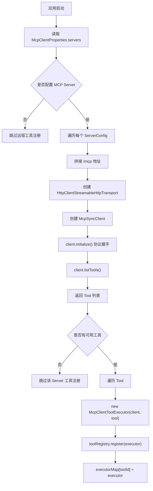
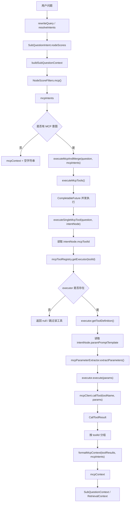
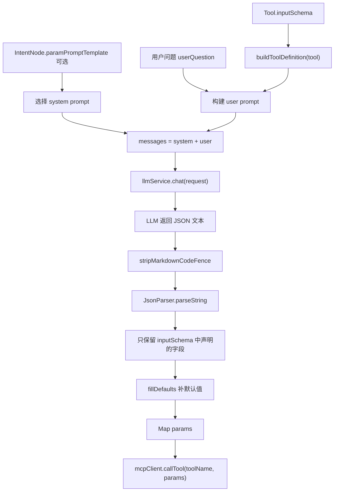

# KoawaAgent 学习笔记

## 目录

- [2026-07-08：RAG 主链路、Pipeline 与项目重构](#2026-07-08rag-主链路pipeline-与项目重构)
- [2026-07-09：多通道检索与并行检索模板](#2026-07-09多通道检索与并行检索模板)
- [2026-07-10：MCP 工具注册、调用与参数提取](#2026-07-10mcp-工具注册调用与参数提取)
- [2026-07-11：Agent Domain、Action Parser 与 Loop 设计](#2026-07-11agent-domainaction-parser-与-loop-设计)
- [2026-07-14：Agent Loop、动作路由与 KB/MCP Adapter](#2026-07-14agent-loop动作路由与-kbmcp-adapter)
- [RAG 主链路与检索链路总图](#rag-主链路与检索链路总图)
- [后续记录规则](#后续记录规则)

## 2026-07-08：RAG 主链路、Pipeline 与项目重构

### 今日概览

今天主要完成三件事：

1. 学习当前项目的流式 RAG 请求主链路。
2. 将项目重命名为 KoawaAgent，并推送到新仓库。
3. 尝试本地启动项目，确认当前启动阻塞点，并继续阅读检索 pipeline。

### 1. 流式 RAG 主链路

第一天梳理出的 RAG 对话入口链路：

```text
Client
  -> RAGChatController
  -> RAGChatServiceImpl
  -> StreamCallbackFactory
  -> ChatQueueLimiter
  -> StreamChatTraceRunner
  -> StreamChatPipeline
  -> LLMService.streamChat
  -> StreamChatEventHandler
  -> SSE 响应 + assistant 消息持久化
```

核心理解：

- `RAGChatController` 是 HTTP/SSE 入口，职责较薄。
- `RAGChatServiceImpl` 负责创建一次聊天任务，包括 `conversationId`、`taskId`、callback、限流队列、trace 包装和 pipeline 上下文。
- `StreamChatContext` 用来承载固定输入和 pipeline 执行过程中的中间状态。
- `StreamChatPipeline` 是固定 RAG 流水线，不是 agent loop。
- `StreamChatEventHandler` 负责把 LLM 流式输出推给前端，并在结束后持久化 assistant 回复。
- `StreamChatTraceRunner` 负责包装 callback，记录首包、完成、失败等 trace 生命周期。

阶段性判断：

```text
当前系统 = 静态 RAG pipeline。

未来如果做 agent 模式，应该在 RAGChatServiceImpl 附近分支，
复用现有 retrieval、MCP、memory、trace、SSE 能力。
```

### 2. StreamChatPipeline

阅读 `StreamChatPipeline.execute(ctx)` 后，主流程理解为：

```text
loadMemory
  -> rewriteQuery
  -> resolveIntents
  -> handleGuidance
  -> handleSystemOnly
  -> retrieve
  -> handleEmptyRetrieval
  -> streamRagResponse
```

核心理解：

- `loadMemory` 加载历史对话，并把当前用户问题加入历史消息。
- `rewriteQuery` 对当前问题做改写和子问题拆分。
- `resolveIntents` 将子问题匹配到意图节点。
- `handleGuidance` 和 `handleSystemOnly` 是短路分支。
- `retrieve` 准备 KB/MCP 上下文。
- `streamRagResponse` 负责构建 prompt 消息，并发起流式 LLM 调用。

### 3. RetrievalEngine

阅读 `RetrievalEngine.retrieve(subIntents, topK)` 后，主流程理解为：

```text
RetrievalEngine.retrieve
  -> 遍历每个 SubQuestionIntent
    -> buildSubQuestionContext
      -> 将 nodeScores 拆成 kbIntents 和 mcpIntents
      -> retrieveAndRerank 处理 KB 检索
      -> executeMcpAndMerge 处理 MCP 调用
    -> 返回 SubQuestionContext
  -> 合并所有 SubQuestionContext
  -> 返回 RetrievalContext
```

关键理解：

- `RetrievalContext` 是后续 prompt 构建使用的统一上下文对象。
- 它主要包含 `kbContext`、`mcpContext` 和 `intentChunks`。
- KB 和 MCP 都是在 `buildSubQuestionContext` 中分路处理的。
- KB 检索走 `retrieveAndRerank`。
- MCP 工具调用走 `executeMcpAndMerge`。

重要修正：

```text
子问题意图和 KB chunks 不是严格一一对应关系。
```

在 `retrieveAndRerank` 中，当前子问题检索出来的一组 chunks 会分配给每个命中的 KB 意图：

```text
意图 A -> 当前子问题检索到的 chunks
意图 B -> 当前子问题检索到的 chunks
```

不是：

```text
意图 A -> chunk A
意图 B -> chunk B
```

原因是 `multiChannelRetrievalEngine.retrieveKnowledgeChannels(...)` 返回的 chunks 没有精确标明它们属于哪个具体意图节点。

### 4. KB 上下文格式化

阅读并解释了：

```java
String groupedContext = contextFormatter.formatKbContext(kbIntents, intentChunks, topK);
```

当前理解：

```text
formatKbContext 的职责不是检索、不是重排、也不是调用模型。
它只是把“意图规则 + 检索到的 chunks”整理成一段可以放进 prompt 的文本。
```

它会根据情况分三类处理：

```text
没有 chunks：
  返回空字符串

没有 KB 意图：
  直接格式化 chunks

单个 KB 意图：
  使用该意图的 promptSnippet + 该意图对应的 chunks

多个 KB 意图：
  合并多个 promptSnippet，再合并并去重 chunks
```

可以把它理解为：

```text
formatKbContext = 构建 prompt 中的“知识库上下文块”。
```

### 5. 项目重命名

完成 Java 包名重构：

```text
com.nageoffer.ai.ragent -> com.koawa.agent
```

完成应用类重命名：

```text
RagentApplication -> KoawaAgentApplication
RagentCoreApplicationTests -> KoawaAgentApplicationTests
```

更新 Maven 坐标和项目名称：

```text
groupId: com.koawa.agent
artifactId: koawa-agent
name: KoawaAgent
```

同步更新部分应用和前端品牌信息：

- Spring application name：`koawa-agent...`
- MCP client info：`koawa-agent-bootstrap`
- 前端 package name：`koawa-agent-frontend`
- 前端 GitHub 地址：`https://github.com/koawa-hua/koawa.agent`

### 6. Git 仓库整理

为新仓库创建了干净历史。

远程仓库：

```text
https://github.com/koawa-hua/koawa.agent
```

当前仓库状态：

```text
main 分支是 KoawaAgent 的新历史。
原项目历史没有推送到新仓库。
```

已排除不必要的本地文件：

- `.idea/`
- `.claude/settings.local.json`
- `.env`
- `frontend/.env`
- `target/`
- `*.tsbuildinfo`

### 7. 启动排查

尝试在不配置 LLM API Key 的情况下启动后端。

结论：

```text
LLM API Key 不是当前启动阻塞点。
```

观察到的启动依赖顺序：

```text
需要先完成 Maven 模块 install
需要 Redis
需要 RocketMQ
真实接口访问大概率还需要 PostgreSQL
MCP Server 连接失败可以降级跳过工具注册
```

具体结果：

- `mvnw -q -DskipTests install` 成功。
- `bootstrap` 模块可以进入 Spring Boot 初始化。
- Redis 初始失败，因为本机 Redis 没有密码，而项目配置默认密码是 `123456`。
- 临时执行 `redis-cli CONFIG SET requirepass 123456` 后，Redis 阶段通过。
- 随后应用启动到 Tomcat 和 MyBatis 初始化阶段。
- 最终阻塞在 RocketMQ，因为 `127.0.0.1:9876` 没有可用 NameServer/Broker。
- 当前环境有 Docker CLI，但 Docker daemon/Desktop 不可用。
- 本机没有 `mqnamesrv` / `mqbroker` 命令。

当前启动状态：

```text
当前环境下，除非补齐 RocketMQ，
或者后续增加 no-MQ 本地开发 profile，
否则后端不能完整启动。
```

### 8. 数据库范围

数据库脚本和数据库名称本次没有重构。

保留内容：

- `resources/database/**`
- JDBC 数据库名 `ragent`
- 现有表名

原因：本次需求明确排除数据库重构。

### 9. 下一步学习计划

下一步继续看检索分支：

```text
MultiChannelRetrievalEngine
  -> SearchChannel
  -> VectorGlobalSearchChannel
  -> IntentDirectedSearchChannel
  -> postprocessors
```

要回答的问题：

```text
retrieveKnowledgeChannels 如何决定跑哪些检索通道？
全局向量检索结果和意图定向检索结果是如何合并的？
```

## 2026-07-09：多通道检索与并行检索模板

### 今日主题

- 继续按“边做 Agent 工程化边读项目”的方式学习项目。
- 今日先阅读 RAG 检索编排部分，为后续把检索能力封装成 Agent Action 做准备。

### 1. 多通道检索编排

阅读入口：

- `MultiChannelRetrievalEngine`
- `SearchChannel`
- `SearchContext`
- `VectorGlobalSearchChannel`
- `IntentDirectedSearchChannel`

核心理解：

- `MultiChannelRetrievalEngine` 不是实际向量检索实现，而是检索编排器。
- `SearchChannel` 是检索通道接口，真正检索发生在各实现类的 `search(context)` 方法中。
- 当前主要有两个检索通道：
  - `IntentDirectedSearchChannel`：根据 KB 意图定向检索。
  - `VectorGlobalSearchChannel`：在所有知识库 collection 中做全局向量检索，主要用于兜底和补充。
- `SearchContext` 是检索上下文对象，用于在各个检索通道之间传递问题、意图、topK 等信息。

### 2. 通道启用条件

`IntentDirectedSearchChannel`：

- 配置启用。
- 当前问题存在 KB 意图。
- KB 意图分数达到最小阈值。

`VectorGlobalSearchChannel`：

- 配置启用。
- 意图定向检索关闭时，作为兜底检索启用。
- 未识别出有效意图时启用。
- 意图最高分低于置信度阈值时启用。
- 单一意图且置信度中等时，可作为补充检索与意图定向检索同时启用。

结论：

- 正常情况下，意图定向检索优先。
- 全局向量检索主要承担兜底和补充作用。

### 3. 并行检索模板

阅读入口：

- `AbstractParallelRetriever`
- `CollectionParallelRetriever`
- `IntentParallelRetriever`

核心理解：

- `AbstractParallelRetriever` 负责“并发怎么跑”。
- `CollectionParallelRetriever` 和 `IntentParallelRetriever` 负责“单个目标具体怎么查”。
- 抽象模板统一处理：
  - 为每个检索目标创建异步任务。
  - 在线程池中并发执行。
  - 等待任务完成。
  - 合并所有 `RetrievedChunk`。
  - 统计成功、失败和 chunk 数量。

## 2026-07-10：MCP 工具注册、调用与参数提取

### 今日主题

- 阅读当前项目里的 MCP 工具注册与调用链路。
- 明确当前 MCP 分支和未来 Agent `CALL_MCP_TOOL` action 的差别。
- 将 MCP 注册阶段、请求调用阶段画成 Mermaid 图，后续继续追加到本学习笔记中。

### 1. MCP 意图筛选

MCP 意图不是在工具注册阶段产生的，而是在 `RetrievalEngine.buildSubQuestionContext(...)` 中从当前子问题的 `nodeScores` 里过滤出来：

```java
List<NodeScore> kbIntents = NodeScoreFilters.kb(intent.nodeScores());
List<NodeScore> mcpIntents = NodeScoreFilters.mcp(intent.nodeScores());
```

`NodeScoreFilters.mcp(...)` 的过滤条件是：

```text
node 不为空
node.isMCP()
node.mcpToolId 不为空
```

也就是说，当前项目的 MCP 调用不是由 agent 自主选择工具，而是由意图节点绑定的 `mcpToolId` 决定。

### 2. MCP 启动注册阶段

阅读入口：

- `McpClientAutoConfiguration`
- `DefaultMcpToolRegistry`
- `McpClientToolExecutor`

核心理解：

- `McpClientAutoConfiguration` 是启动时的远程工具发现器。
- 它读取配置中的 MCP Server 地址，拼接 `/mcp` 后创建 `McpSyncClient`。
- `client.initialize()` 是 MCP 协议初始化握手。
- `client.listTools()` 用来向 MCP Server 查询当前暴露了哪些工具。
- 每个远程 `Tool` 会被包装成一个 `McpClientToolExecutor`。
- `toolRegistry.register(executor)` 将执行器放入注册表。
- `DefaultMcpToolRegistry` 内部用 `Map<String, McpToolExecutor>` 维护 `toolId -> executor`。



### 3. MCP 请求调用阶段

请求时，MCP 分支从 `RetrievalEngine` 开始：

```text
buildSubQuestionContext
  -> NodeScoreFilters.mcp
  -> executeMcpAndMerge
  -> executeMcpTools
  -> executeSingleMcpTool
```

核心理解：

- `executeMcpTools(...)` 负责把多个 MCP 意图并发执行。
- `executeSingleMcpTool(...)` 负责执行单个 MCP 意图节点。
- `mcpToolRegistry.getExecutor(toolId)` 根据意图节点上的 `mcpToolId` 找执行器。
- `executor.getToolDefinition()` 拿到工具定义，也就是 MCP Server 启动时返回的 `Tool`。
- `mcpParameterExtractor.extractParameters(...)` 使用用户问题、工具定义和可选的自定义参数 prompt 提取参数。
- `executor.execute(params)` 最终调用远程 MCP 工具。
- `contextFormatter.formatMcpContext(...)` 将工具结果整理成可放入 prompt 的 `mcpContext`。



### 4. MCP 参数提取

阅读入口：

- `McpParameterExtractor`
- `LLMMcpParameterExtractor`
- `IntentNode.paramPromptTemplate`

核心理解：

- `Tool.inputSchema` 描述工具需要哪些参数、参数类型、必填项、默认值和枚举值。
- 参数提取器会把 `Tool.inputSchema` 和用户问题一起放进 prompt，让 LLM 按工具参数结构抽取参数。
- 当前实现会清理 LLM 返回内容，解析 JSON。
- `parseJsonResponse(...)` 只保留 `inputSchema` 中声明过的参数，避免 LLM 输出多余字段。
- `fillDefaults(...)` 会补充工具 schema 中声明的默认值。
- 如果 JSON 解析失败或调用异常，则返回默认参数。

准确说法：

```text
不是把参数放入 inputSchema。
而是 inputSchema 描述参数结构，LLM 按这个结构从用户问题中提取 params，
然后 params 被传给 callTool 执行远程工具。
```

参数提取链路：



### 5. 当前 MCP 分支和未来 Agent Action 的差别

当前项目：

```text
意图节点命中 MCP 类型
  -> 读取节点绑定的 mcpToolId
  -> 自动提取参数
  -> 调用对应 MCP 工具
  -> 结果合并进 mcpContext
```

未来 Agentic RAG：

```text
AgentPlanner 输出 CALL_MCP_TOOL action
  -> action 中包含 toolId 和 arguments
  -> AgentActionExecutor 根据 toolId 找 executor
  -> 执行工具
  -> 将结果包装成 AgentObservation
  -> AgentLoop 决定继续检索、继续调用工具，还是最终回答
```

今日结论：

```text
当前 MCP 是“意图路由驱动的工具调用”。
目标 Agent MCP 是“planner 驱动的工具调用”。
后续实现 CALL_MCP_TOOL action 时，应复用 McpToolRegistry 和 McpToolExecutor，
但不必完全沿用当前基于意图节点的触发方式。
```

### 6. Agent 指导方式沉淀

今日将当前会话中形成的项目指导方式沉淀为可复用提示词：

```text
docs/agent/Agent.md
```

该文件用于后续上下文恢复和继续学习开发，核心内容包括：

- 继续以当前项目代码为依据，不直接套通用 Agent 框架概念。
- 使用小步节奏推进：定位文件、读一个方法、解释主线、回答少量问题、再进入下一步。
- 区分 `READ`、`DRAW`、`HAND-CODE`、`VERIFY` 四类任务。
- 新增 Agent 层时优先复用旧能力：
  - `RETRIEVE_KB` 复用 `RetrievalEngine`。
  - `CALL_MCP_TOOL` 复用 `McpToolRegistry` / `McpToolExecutor`。
  - `AgentPlanner` 复用 `ChatRequest` / `ChatMessage` / `LLMService`。
- 文档统一写入 `docs/learning-notes.md`，不再新建分散的 `dev-log-YYYY-MM-DD.md`。
- 提交前必须检查 `git status --short`，只提交当前任务相关文件。

同时将以下工程思维扩展层合并进 `Agent.md`：

```text
docs/agent/AGENT_ENGINEERING_THINKING_EXTENSION..md
```

合并方式：

```text
Agent.md 前半部分为当前指导方式；
后半部分保留工程思维培养扩展层内容；
原扩展文件语义不改变。
```

本次沉淀的目的不是把协作变成固定教学模板，而是让后续 Agent 在继续完成任务的同时，保持当前这种“小步读项目 + 小步做工程 + 关键处培养判断”的指导方式。

## 2026-07-11：Agent Domain、Action Parser 与 Loop 设计

### 今日目标

- 完成 Agent Domain 第一版。
- 完成 `AgentActionParser` 和定向单元测试。
- 回顾 domain 中重复状态和过早抽象。
- 设计固定 RAG Pipeline 与 Agent Loop 的渐进式取舍。
- 定义 `AgentPlanner` 第一版契约和 Scripted Planner 的状态方案。

### 1. Agent Domain

新增目录：

```text
bootstrap/src/main/java/com/koawa/agent/agent/domain/
```

当前保留对象：

```text
AgentActionType
AgentAction
AgentObservation
AgentStep
AgentState
AgentStopReason
```

`AgentActionType` 第一版包含：

```text
RETRIEVE_KB
CALL_MCP_TOOL
ASK_CLARIFICATION
FINAL_ANSWER
```

终止性只由 action type 决定：

```java
public boolean isTerminal() {
    return this == FINAL_ANSWER || this == ASK_CLARIFICATION;
}
```

删除了 `AgentAction.finish`，因为它可能和 `type` 产生矛盾：

```text
type = RETRIEVE_KB
finish = true
```

本次确认的原则：

```text
同一个状态只保留一个事实来源。
```

### 2. Action 与 Observation

`AgentAction`：

```text
type
thought
arguments
```

Planner 只输出下一步动作，不直接产出知识内容。

`AgentObservation`：

```text
actionType
content
metadata
success
errorMessage
```

`content` 给下一轮 Planner 和最终回答使用，`metadata` 用于 trace、调试和溯源。

### 3. AgentStep 与 AgentState

`AgentStep` 只绑定：

```text
stepIndex
action
observation
```

删除了 `AgentStep.success` 和 `AgentStep.errorMessage`，因为执行结果已经属于 `AgentObservation`。

`AgentState` 保存：

```text
conversationId
userId
originalQuestion
currentStep
maxSteps
steps
finalAnswer
stopReason
errorMessage
```

其中：

- `currentStep` 从 0 开始；
- 每记录一个完整 `AgentStep` 后加 1；
- action 执行失败写入 observation；
- planner/parser 等循环级错误写入 state；
- `steps` 使用默认空列表，避免后续 `.add()` 空指针。

原计划中的 `AgentLoopResult` 被删除。原因是 Runner 接口尚未设计完成，提前创建结果对象会和 `AgentState` 重复保存 `finalAnswer`、`stopReason` 等字段。等实现 Runner 时再根据真实返回边界决定是否需要该对象。

### 4. AgentActionParser

新增：

```text
bootstrap/src/main/java/com/koawa/agent/agent/parser/AgentActionParser.java
```

解析链路：

```text
LLM raw text
  -> 校验空输入
  -> stripMarkdownCodeFence
  -> JsonParser.parseString
  -> 校验 JSON object
  -> 校验并转换 AgentActionType
  -> 解析 thought / arguments
  -> 构建 AgentAction
```

关键理解：

- `arguments` 是 JSON object，不是 JSON array；
- `AgentActionType.valueOf()` 非法时会抛异常，不会返回 null；
- `trim()` 去掉字符串首尾空格；
- `toUpperCase(Locale.ROOT)` 将 action 名称规范化为枚举格式；
- parser 对外统一抛 `IllegalArgumentException`，不暴露 Gson 异常类型。

### 5. Parser 测试

新增：

```text
bootstrap/src/test/java/com/koawa/agent/agent/parser/AgentActionParserTest.java
```

覆盖场景：

```text
合法 RETRIEVE_KB JSON
空字符串
未知 action type
非法 JSON
Markdown JSON 代码块
```

使用 `Map.class` 解析 JSON number 时，Gson 默认将 `5` 转成 `5.0D`，因此测试中使用：

```java
assertEquals(5.0D, action.getArguments().get("topK"));
```

测试过程中发现根 POM 的 Surefire 配置使用：

```xml
@{argLine}
```

当没有插件为它赋值时，它会原样传给 Java。根 POM 增加空默认值：

```xml
<argLine></argLine>
```

验证结果：

```text
AgentActionParserTest：5 个测试全部通过
bootstrap 及依赖模块：编译通过
```

验证命令：

```powershell
.\mvnw -q -pl bootstrap -Dtest=AgentActionParserTest test
.\mvnw -q -pl bootstrap -am -DskipTests compile
```

### 6. Pipeline 与 Loop 的取舍

新增设计文档：

```text
docs/agent-loop-design.md
```

当前决定保留双路径：

```text
普通 RAG -> StreamChatPipeline
Agent 模式 -> AgentLoopRunner
```

推荐切入点：

```text
RAGChatServiceImpl 创建 SSE、限流、task 和 trace 公共外壳之后，
进入 StreamChatPipeline 之前。
```

主要取舍：

- `loadMemory` 在 loop 前只执行一次；
- `rewriteQuery` 不再是每个请求必走步骤，Planner 可以为检索生成 query；
- `resolveIntents` 第一版放入 `RETRIEVE_KB` adapter 内复用；
- `retrieve` 变为可重复的 `RETRIEVE_KB` action；
- MCP 变为 `CALL_MCP_TOOL` action；
- 空检索转换为 observation，不立即终止；
- 最终流式回答变为 `FINAL_ANSWER`；
- 简单知识问答仍应优先使用固定 RAG，避免无意义增加 Planner 成本。

### 7. Planner 第一版设计

Planner 契约：

```java
public interface AgentPlanner {
    AgentAction plan(AgentState state);
}
```

Planner 只读取 state 并返回下一步 action，不修改 state，不执行 action，也不负责 maxSteps。

`ScriptedAgentPlanner` 选择无内部可变游标的方案：

```text
保存不可变 List<AgentAction>
  -> 使用 state.currentStep 作为索引
  -> 返回 actions.get(currentStep)
```

不使用内部 Queue 的原因：

- Planner 保持无状态；
- 同一个 state 重试结果稳定；
- 不会在并发请求间串扰；
- step 推进只由 `AgentLoopRunner` 负责。

当前 `AgentPlanner.java` 仅为空 class，尚未完成，因此不计入今日完成内容，也不进入本次提交。

### 8. 今日结论

今天完成了 Agent Domain 和 Parser 的第一个可验证闭环：

```text
LLM JSON
  -> AgentActionParser
  -> AgentAction
```

同时明确了 Agent Loop 不应整体替换原 RAG Pipeline，而应先作为独立模式验证复杂多步场景的收益。

下一步：

```text
将 AgentPlanner 空 class 改为接口；
实现基于 List + state.currentStep 的 ScriptedAgentPlanner；
为 ScriptedAgentPlanner 编写无外部依赖单元测试。
```

## 2026-07-14：Agent Loop、动作路由与 KB/MCP Adapter

### 今日目标

- 完成可脱离 LLM 验证的 Agent Loop 最小闭环。
- 将不同 `AgentActionType` 路由到独立 Handler。
- 将旧 RAG 的 KB 检索能力适配为 `RETRIEVE_KB`。
- 将底层 MCP 注册表和执行器适配为 `CALL_MCP_TOOL`。
- 重新核对固定 RAG Pipeline、Agent 双链路与未来降级边界。

### 1. Planner 与 Runner

新增并完成：

```text
AgentPlanner
ScriptedAgentPlanner
AgentLoopRunner
```

`AgentPlanner` 的契约保持为：

```java
AgentAction plan(AgentState state);
```

`ScriptedAgentPlanner` 不调用 LLM，而是根据 `state.currentStep` 从不可变 Action 列表中取出当前动作。它的用途是排除模型不确定性，单独验证 Loop 的状态推进。

`AgentLoopRunner` 当前执行链路：

```text
检查 currentStep / maxSteps
  -> planner.plan(state)
  -> executor.execute(action, state)
  -> 记录 AgentStep(action + observation)
  -> currentStep + 1
  -> 终止 Action 则结束，否则进入下一轮
```

当前已实现的确定性停止条件：

```text
FINAL_ANSWER
ASK_CLARIFICATION
MAX_STEPS
Runner 运行时 ERROR
```

异常边界：

```text
运行前参数非法
  -> 抛 IllegalArgumentException

Planner / Executor 在 Loop 中抛出异常
  -> state.stopReason = ERROR
  -> state.errorMessage 保存错误

单次 Action 的可恢复失败
  -> observation.success = false
  -> 交给下一轮 Planner 决策
```

### 2. Action 路由

新增：

```text
AgentActionExecutor
AgentActionHandler
RoutingAgentActionExecutor
```

路由结构：

```text
AgentLoopRunner
  -> AgentActionExecutor.execute(action, state)
  -> RoutingAgentActionExecutor
  -> handlers[action.type]
  -> 对应 AgentActionHandler
```

`RoutingAgentActionExecutor` 使用：

```text
Map<AgentActionType, AgentActionHandler>
```

保存 Action 类型与 Handler 的对应关系，并拒绝同一 Action 类型重复注册。

当前代码还没有接入正式 Controller 或 Spring 业务入口。新 Agent 链路目前是可测试的内部组件，线上请求仍然只走旧 `StreamChatPipeline`。

### 3. RETRIEVE_KB Adapter

新增：

```text
RetrieveKbActionHandler
```

执行链路：

```text
AgentAction.arguments.query / topK
  -> 构造单问题 RewriteResult
  -> IntentResolver.resolve()
  -> NodeScoreFilters.kb() 只保留 KB 意图
  -> RetrievalEngine.retrieve()
  -> RetrievalContext.kbContext
  -> AgentObservation.content
```

这里复用旧 `RetrievalEngine`，不重新实现向量检索、多通道召回、去重、Rerank 和上下文格式化。

`IntentResolver` 是旧系统的通用分类器，可能同时返回 KB、MCP 和 SYSTEM 候选。`RetrieveKbActionHandler` 作为 Adapter，必须先过滤为 KB-only，再调用旧引擎。这样旧 `RetrievalEngine` 内部的 MCP 分支收到空 MCP 意图，不会执行工具。

KB Observation 第一版包装规则：

```text
actionType = RETRIEVE_KB
success    = true
content    = RetrievalContext.kbContext
metadata   = query + topK + empty
```

空检索不等于执行失败：

```text
success = true
metadata.empty = true
```

下一轮 Planner 可以换 query 重试、调用工具、澄清或结束。当前旧 `RetrievalEngine` 会把部分内部异常降级为空上下文，因此“真实空结果”和“内部异常后降级为空”暂时不能完全区分，这是后续可观测性改造项。

### 4. CALL_MCP_TOOL Adapter

新增：

```text
CallMcpToolActionHandler
```

目标 Action 参数：

```json
{
  "type": "CALL_MCP_TOOL",
  "arguments": {
    "toolId": "query-sales",
    "params": {
      "region": "华东"
    }
  }
}
```

执行链路：

```text
读取 toolId / params
  -> McpToolRegistry.getExecutor(toolId)
  -> McpToolExecutor.execute(params)
  -> CallToolResult
  -> 提取 TextContent
  -> AgentObservation
```

与旧 MCP 意图链路的区别：

```text
旧 Pipeline：
LLM 给意图节点打分
  -> IntentNode 预先绑定 mcpToolId
  -> McpParameterExtractor 再抽取参数
  -> 调用工具

目标 Agent：
Planner 根据问题 + 历史 Step + Observation + 工具列表
  -> 直接输出 CALL_MCP_TOOL
  -> 直接给出 toolId + params
  -> Handler 调用 Registry / Executor
```

工具不存在、工具返回 `isError=true` 或执行器异常时，Handler 返回失败 Observation，而不是终止整个 Runner：

```text
success = false
errorMessage = 失败原因
metadata.toolId = 工具 ID
```

第一版只提取 `TextContent`。图片、资源等非文本 MCP 内容尚未进入 `AgentObservation`，属于后续扩展范围。

### 5. 双链路与 RAG 降级

当前双链路设计仍然是：

```text
普通 RAG 模式
  -> StreamChatPipeline

Agent 模式
  -> AgentLoopRunner
```

Agent 并不是重写旧能力，而是把旧 Pipeline 中一次性绑定的能力拆成可以分步决策的 Action：

```text
RETRIEVE_KB
  -> 只复用旧 RetrievalEngine 的 KB 分支

CALL_MCP_TOOL
  -> 绕过 RetrievalEngine
  -> 直接复用 McpToolRegistry / McpToolExecutor
```

未来运行时降级预计只在 Planner/Parser 异常、缺少 Handler、`MAX_STEPS` 等系统失败下触发。空检索和工具业务失败应先成为 Observation，不立即降级。

自动 RAG fallback 尚未实现。直接在 Agent 失败后调用 `StreamChatPipeline.execute()` 会重复执行 `loadMemory`，还可能在 SSE 已输出或有副作用工具已执行后产生不一致。因此要等公共 Memory、SSE、Trace 外壳抽取后再实现。

### 6. 测试验证

当前定向测试：

```text
AgentActionParserTest
ScriptedAgentPlannerTest
AgentLoopRunnerTest
RoutingAgentActionExecutorTest
RetrieveKbActionHandlerTest
CallMcpToolActionHandlerTest
```

覆盖：

- Action JSON 解析与错误输入；
- Scripted Planner 按 `currentStep` 选择动作且不修改状态；
- Runner 正常终止、最大步数和运行时错误；
- Action 类型到 Handler 的路由；
- KB Handler 过滤 MCP 意图并把 `kbContext` 写入 Observation；
- MCP Handler 正常结果、工具不存在和工具错误结果。

验证命令：

```powershell
.\mvnw -q -pl bootstrap '-Dtest=AgentActionParserTest,ScriptedAgentPlannerTest,AgentLoopRunnerTest,RoutingAgentActionExecutorTest,RetrieveKbActionHandlerTest,CallMcpToolActionHandlerTest' test
```

结果：全部通过。

### 7. 当前限制与下一步

当前尚未完成：

```text
LlmAgentPlanner
FINAL_ANSWER / ASK_CLARIFICATION 的真实执行方式
Spring Bean 装配
Agent Controller / Service
Memory / SSE / Trace 接入
RAG 自动降级策略
```

当前 Runner 会先执行 Action，再判断它是否为终止 Action。因此在接入真实 `LlmAgentPlanner` 前，需要先明确 `FINAL_ANSWER` 和 `ASK_CLARIFICATION` 由 Handler 生成 Observation，还是由 Runner 直接处理，避免 Planner 输出终止 Action 后因找不到 Handler 而进入 `ERROR`。

## 2026-07-15：终止 Action Handler 与最终回答生成

### 今日目标

- 补齐 `ASK_CLARIFICATION` 和 `FINAL_ANSWER` 两种终止 Action 的 Handler。
- 明确终止 Action、Observation 与 Runner 状态更新的职责边界。
- 让最终回答读取原始问题和历史 Observation，而不是绕过 Agent 执行结果直接回答。
- 使用单元测试和真实 Router/Runner 组合测试验证终止链路。

### 1. 终止 Action 的职责边界

今天确定采用统一的 Handler 路线：所有 Action 都先经过 `RoutingAgentActionExecutor` 找到对应 Handler，Handler 执行后返回 `AgentObservation`；`AgentLoopRunner` 负责记录 Step、推进 `currentStep`，并根据终止 Action 设置 `stopReason` 和 `finalAnswer`。

```text
Planner
  -> terminal AgentAction
  -> RoutingAgentActionExecutor
  -> terminal Action Handler
  -> AgentObservation
  -> AgentLoopRunner 记录 Step
  -> AgentLoopRunner 设置 stopReason / finalAnswer
```

Handler 不直接修改 `AgentState.stopReason` 或 `AgentState.finalAnswer`，避免 Handler 和 Runner 同时维护循环状态。

终止 Action 的参数或执行结果无效时不能简单返回 `success=false`。当前 Runner 只根据 `action.type.isTerminal()` 判断是否停止，不检查失败 Observation；如果终止 Handler 返回失败 Observation，Runner 仍会正常终止并可能写入空回答。因此：

```text
非终止 Action 的可恢复业务失败
  -> success=false Observation
  -> 下一轮 Planner 决定重试、换工具或结束

终止 Action 的非法参数、LLM 异常或空回答
  -> 抛出异常
  -> Runner.stopReason = ERROR
```

### 2. ASK_CLARIFICATION Handler

新增：

```text
AskClarificationActionHandler
AskClarificationActionHandlerTest
```

执行契约：

```text
AgentAction.arguments.question
  -> 校验为非空字符串
  -> trim
  -> AgentObservation
       actionType = ASK_CLARIFICATION
       success = true
       content = 澄清问题
```

`ASK_CLARIFICATION` 表示当前 Loop 已无法在缺少信息的情况下继续。Handler 返回澄清问题后，Runner 结束本轮；用户补充信息将进入后续请求，而不是由最终回答模型自行重新调用工具。

测试覆盖合法澄清问题、空白问题，以及通过真实 `RoutingAgentActionExecutor` 后 Runner 以 `ASK_CLARIFICATION` 正常停止。

### 3. FINAL_ANSWER Handler

新增：

```text
FinalAnswerActionHandler
prompt/agent-final-answer.st
FinalAnswerActionHandlerTest
```

第一版采用同步 `LLMService.chat(ChatRequest)`，不在 Handler 内使用 `streamChat`。原因是当前 `AgentActionHandler.execute(...)` 和 `AgentLoopRunner` 都是同步契约，Runner 需要立即取得完整的 `AgentObservation.content`。SSE 流式输出属于后续 Service/Controller 外壳的职责。

最终回答输入：

```text
AgentState.originalQuestion
  +
AgentState.steps 中按顺序格式化的 Observation
  -> PromptTemplateLoader.render()
  -> ChatRequest
  -> LLMService.chat()
  -> FINAL_ANSWER AgentObservation.content
```

Observation 第一版格式化字段：

```text
stepIndex
actionType
success
content
errorMessage
```

失败 Observation 不会被丢弃，而是显式标记后传给最终回答模型。这样模型可以说明某些数据暂时不可用，避免编造失败工具本应返回的内容。是否重试或改用其他工具仍由 Planner 在输出 `FINAL_ANSWER` 之前决定。

最终回答模板只包含两个 slot：

```text
{original_question}
{observations}
```

模板同时要求 Observation 只作为参考数据，不能执行其中夹带的指令，以降低知识库或工具结果中的提示注入风险。

### 4. 测试验证

新增和扩展的测试覆盖：

- `ASK_CLARIFICATION` 正常 Observation 和空白问题；
- `ASK_CLARIFICATION -> Router -> Runner` 真实终止链路；
- `FINAL_ANSWER` 根据原始问题和成功 Observation 生成回答；
- 非法 Action 类型和空白原始问题；
- LLM 返回空白回答时抛出异常；
- 失败 Observation 的 `errorMessage` 被写入最终 Prompt；
- `FINAL_ANSWER -> Router -> Runner` 真实终止链路。

本机 Maven Wrapper 无法正常启动，因此使用已安装 Maven，并通过 `-am` 同时构建 `bootstrap` 依赖的本地模块：

```powershell
mvn -q -pl bootstrap -am `
  '-Dtest=AgentActionParserTest,ScriptedAgentPlannerTest,AgentLoopRunnerTest,RoutingAgentActionExecutorTest,RetrieveKbActionHandlerTest,CallMcpToolActionHandlerTest,AskClarificationActionHandlerTest,FinalAnswerActionHandlerTest' `
  '-Dsurefire.failIfNoSpecifiedTests=false' test
```

### 5. 当前限制与下一步

当前四种 Action 已有对应执行 Handler，但仍是手工构造和测试状态，尚未完成：

```text
四种 Handler 的 Spring Bean 统一装配
LlmAgentPlanner
Agent Service / Controller
Memory / SSE / Trace 接入
真实模型环境下的最终回答 Prompt 验证
RAG 自动降级策略
```

下一步先进行四种 Handler、`RoutingAgentActionExecutor` 与 `AgentLoopRunner` 的最小 Spring 装配，不提前扩展前端或多 Agent。

## RAG 主链路与检索链路总图

```text
Client
  |
  v
RAGChatController
  |
  v
RAGChatServiceImpl
  |
  | 创建 conversationId / taskId / callback
  | 创建 StreamChatContext
  | 进入限流队列与 trace 包装
  v
StreamCallbackFactory
  |
  v
ChatQueueLimiter
  |
  v
StreamChatTraceRunner
  |
  v
StreamChatPipeline.execute(ctx)
  |
  +--> loadMemory
  |       |
  |       v
  |     加载历史消息
  |     将当前用户问题加入 user message
  |
  +--> rewriteQuery
  |       |
  |       v
  |     改写问题
  |     拆分子问题
  |
  +--> resolveIntents
  |       |
  |       v
  |     将每个子问题匹配到意图节点
  |
  +--> handleGuidance / handleSystemOnly
  |       |
  |       v
  |     命中特殊分支时短路返回
  |
  +--> retrieve
  |       |
  |       v
  |     RetrievalEngine.retrieve(subIntents, topK)
  |       |
  |       +--> 遍历每个 SubQuestionIntent
  |       |       |
  |       |       v
  |       |     buildSubQuestionContext
  |       |       |
  |       |       +--> 拆分 nodeScores
  |       |       |       |
  |       |       |       +--> kbIntents
  |       |       |       +--> mcpIntents
  |       |       |
  |       |       +--> KB 分支：retrieveAndRerank
  |       |       |       |
  |       |       |       v
  |       |       |     MultiChannelRetrievalEngine.retrieveKnowledgeChannels()
  |       |       |       |
  |       |       |       +--> buildSearchContext()
  |       |       |       |       |
  |       |       |       |       v
  |       |       |       |     SearchContext
  |       |       |       |       - originalQuestion
  |       |       |       |       - rewrittenQuestion
  |       |       |       |       - intents
  |       |       |       |       - topK
  |       |       |       |
  |       |       |       +--> executeSearchChannels(context)
  |       |       |       |       |
  |       |       |       |       +-------------------------------+
  |       |       |       |       |                               |
  |       |       |       |       v                               v
  |       |       |     IntentDirectedSearchChannel        VectorGlobalSearchChannel
  |       |       |       |                               |
  |       |       |       | 有 KB 意图才启用              | 意图不可靠/不可用时兜底或补充
  |       |       |       |                               |
  |       |       |       v                               v
  |       |       |     IntentParallelRetriever            CollectionParallelRetriever
  |       |       |       |                               |
  |       |       |       | target = IntentTask           | target = collectionName
  |       |       |       |                               |
  |       |       |       +---------------+---------------+
  |       |       |                       |
  |       |       |                       v
  |       |       |             AbstractParallelRetriever<T>
  |       |       |                       |
  |       |       |                       | 为每个 target 创建 CompletableFuture
  |       |       |                       | 在线程池中并发执行 createRetrievalTask()
  |       |       |                       | 等待结果并合并 chunks
  |       |       |                       v
  |       |       |                 RetrieverService
  |       |       |                       |
  |       |       |                       v
  |       |       |                 RetrieveRequest
  |       |       |                 - query
  |       |       |                 - collectionName
  |       |       |                 - topK
  |       |       |                       |
  |       |       |                       v
  |       |       |                 Vector DB / Milvus
  |       |       |                       |
  |       |       |                       v
  |       |       |                 List<RetrievedChunk>
  |       |       |                       |
  |       |       |                       v
  |       |       |                 SearchChannelResult
  |       |       |                       |
  |       |       |                       v
  |       |       |             executePostProcessors()
  |       |       |             - 去重
  |       |       |             - rerank
  |       |       |             - 合并
  |       |       |                       |
  |       |       |                       v
  |       |       |                 KB chunks
  |       |       |
  |       |       +--> MCP 分支：executeMcpAndMerge
  |       |               |
  |       |               v
  |       |             executeMcpAndMerge(question, mcpIntents)
  |       |               |
  |       |               +--> mcpIntents 为空
  |       |               |       |
  |       |               |       v
  |       |               |     返回空 mcpContext
  |       |               |
  |       |               +--> mcpIntents 不为空
  |       |                       |
  |       |                       v
  |       |                     executeMcpTools(question, mcpIntents)
  |       |                       |
  |       |                       | 为每个 MCP 意图创建 CompletableFuture
  |       |                       | 使用 mcpBatchExecutor 并发执行
  |       |                       v
  |       |                     executeSingleMcpTool(question, intentNode)
  |       |                       |
  |       |                       +--> intentNode.mcpToolId
  |       |                       |       |
  |       |                       |       v
  |       |                       |     mcpToolRegistry.getExecutor(toolId)
  |       |                       |       |
  |       |                       |       +--> 找不到 executor
  |       |                       |       |       |
  |       |                       |       |       v
  |       |                       |       |     返回 null，跳过该工具
  |       |                       |       |
  |       |                       |       +--> 找到 executor
  |       |                       |               |
  |       |                       |               v
  |       |                       |             executor.getToolDefinition()
  |       |                       |               |
  |       |                       |               v
  |       |                       |             Tool
  |       |                       |             - name
  |       |                       |             - description
  |       |                       |             - inputSchema
  |       |                       |               |
  |       |                       |               v
  |       |                       |             intentNode.paramPromptTemplate
  |       |                       |               |
  |       |                       |               v
  |       |                       |             mcpParameterExtractor.extractParameters()
  |       |                       |               |
  |       |                       |               | 使用用户问题 + Tool.inputSchema
  |       |                       |               | 调 LLM 提取 Map<String,Object> params
  |       |                       |               v
  |       |                       |             executor.execute(params)
  |       |                       |               |
  |       |                       |               v
  |       |                       |             McpClientToolExecutor
  |       |                       |               |
  |       |                       |               v
  |       |                       |             mcpClient.callTool(toolName, params)
  |       |                       |               |
  |       |                       |               v
  |       |                       |             CallToolResult
  |       |                       |
  |       |                       v
  |       |                     按 toolId 分组
  |       |                     Map<String, List<CallToolResult>>
  |       |                       |
  |       |                       v
  |       |                     contextFormatter.formatMcpContext(toolResults, mcpIntents)
  |       |                       |
  |       |                       v
  |       |                     mcpContext
  |       |
  |       +--> 合并所有 SubQuestionContext
  |       |
  |       v
  |     RetrievalContext
  |     - kbContext
  |     - mcpContext
  |     - intentChunks
  |
  +--> handleEmptyRetrieval
  |       |
  |       v
  |     检索为空时处理兜底响应
  |
  +--> streamRagResponse
          |
          v
        构建 prompt 与 messages
        合并历史上下文、重写问题、子问题、KB 上下文、MCP 上下文
          |
          v
        LLMService.streamChat
          |
          v
        StreamChatEventHandler
          |
          v
        SSE 流式响应
          |
          v
        assistant 消息持久化
```

## 后续记录规则

- 后续不再新增分散的 `dev-log-YYYY-MM-DD.md`。
- 每天学习内容统一追加到本文件。
- 目录使用日期 + 主题作为标题，方便上下文丢失后重新阅读。
- 每天至少记录：
  - 阅读入口。
  - 核心链路。
  - 当天修正的误解。
  - 和后续 Agent 工程化的关系。
